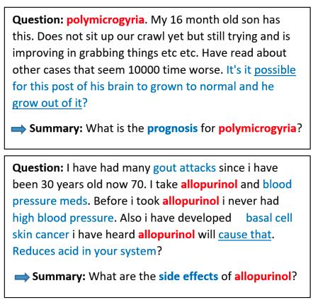
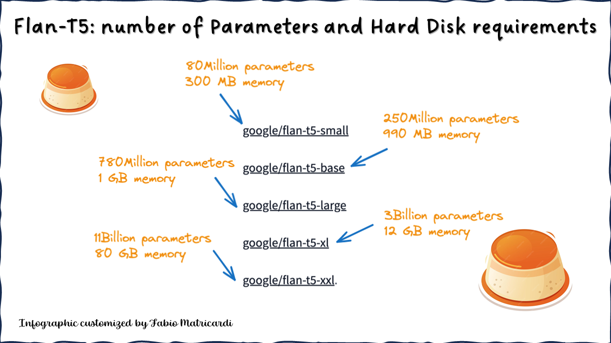

# 🩺 Medical Question Summarization using Flan-T5-Large with LoRA

This project explores fine-tuning the **Flan-T5-Large** model using **LoRA (Low-Rank Adaptation)** for abstractive summarization of complex medical questions from the [MEQSum dataset](https://huggingface.co/datasets/albertvillanova/meqsum). The goal is to generate concise, accurate summaries that retain the core clinical intent of lengthy consumer health questions.

  

## Key Features

- **Parameter-efficient fine-tuning** using LoRA (reduces trainable parameters by ~98%)
- **Flan-T5-Large** (~770M parameters) as the base model
- **Medical domain specialization** for consumer health questions
- **Evaluation metrics**: ROUGE scores for summary quality assessment
- **Hugging Face integration** for model sharing and deployment

## Model Architecture

### Technical Approach

1. **LoRA (Low-Rank Adaptation)**:
   - Trains only small low-rank matrices while keeping original weights frozen
   - Reduces VRAM requirements and training costs
   - Target modules: query, key, and value attention matrices

2. **Flan-T5-Large**:
   - Instruction-tuned variant of T5
   - Handles long input contexts well (512 tokens)
   - Pre-trained on diverse NLP tasks

## Dataset

The [MEQSum dataset](https://huggingface.co/datasets/albertvillanova/meqsum) contains:
- 1,000 consumer health questions
- Professional summaries for each question
- Complex, multi-sentence medical queries

---

## Hugging Face Model & Space

The fine-tuned model and demo are publicly available on Hugging Face for easy access and further experimentation:

- **Model Hub:**  
  [flan-t5-large-medical-summarization-lora](https://huggingface.co/autodidacte228/meqsum-lora-T5-finetuned)  
  

- **Hugging Face Space Demo:**  
  [Medical Question Summarizer](https://huggingface.co/spaces/autodidacte228/meq-sum-T5-lora)  

The Space provides a simple UI where users can input long medical questions and obtain concise summaries generated by the LoRA fine-tuned Flan-T5-Large model.

---

## Results

The model was evaluated using ROUGE metrics on the MEQSum test set, compared with the baseline T5 model and a BART model:

| Metric    | Baseline: T5 | LoRA Flan-T5-Large | BART        |
|-----------|--------------|--------------------|-------------|
| ROUGE-1   | 0.2529       | **0.7363**         | 0.7568      |
| ROUGE-2   | 0.1188       | **0.6371**         | 0.6840      |
| ROUGE-L   | 0.2375       | **0.7288**         | 0.7525      |
| ROUGE-Lsum| 0.2389       | **0.7250**         | 0.7538      |

### Interpretation

- The **LoRA fine-tuned Flan-T5-Large** drastically outperforms the baseline T5 across all ROUGE metrics, showing the effectiveness of low-rank adaptation for domain-specific summarization.
- The performance is close to that of the larger BART model, but with significantly fewer trainable parameters and lower training costs thanks to LoRA.
- These results demonstrate that parameter-efficient fine-tuning can achieve strong clinical summarization quality on complex medical questions.
